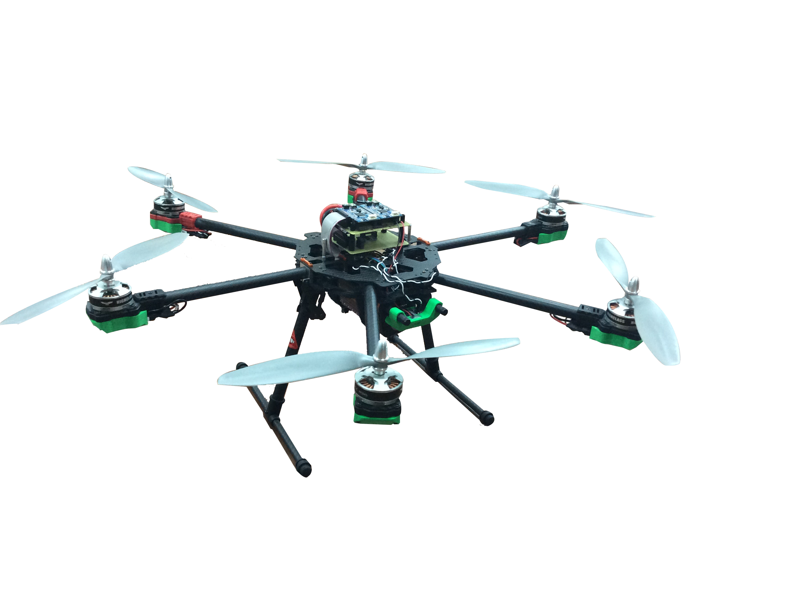
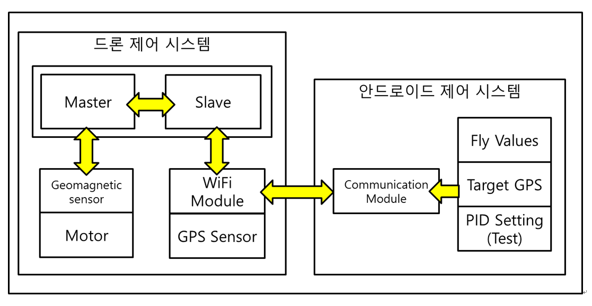
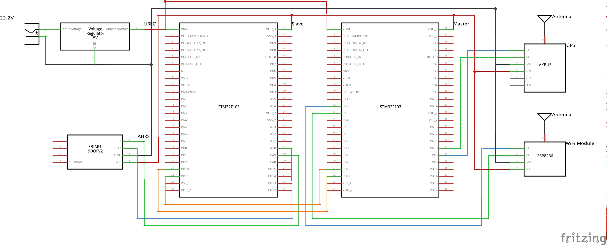
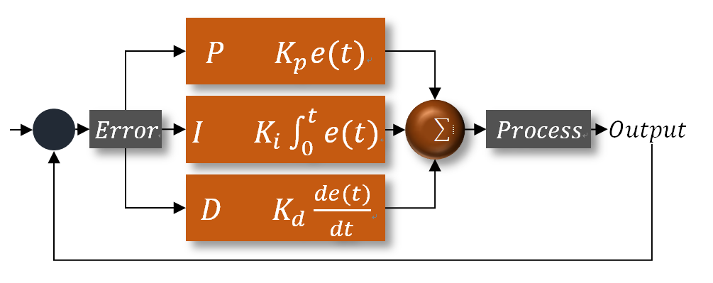
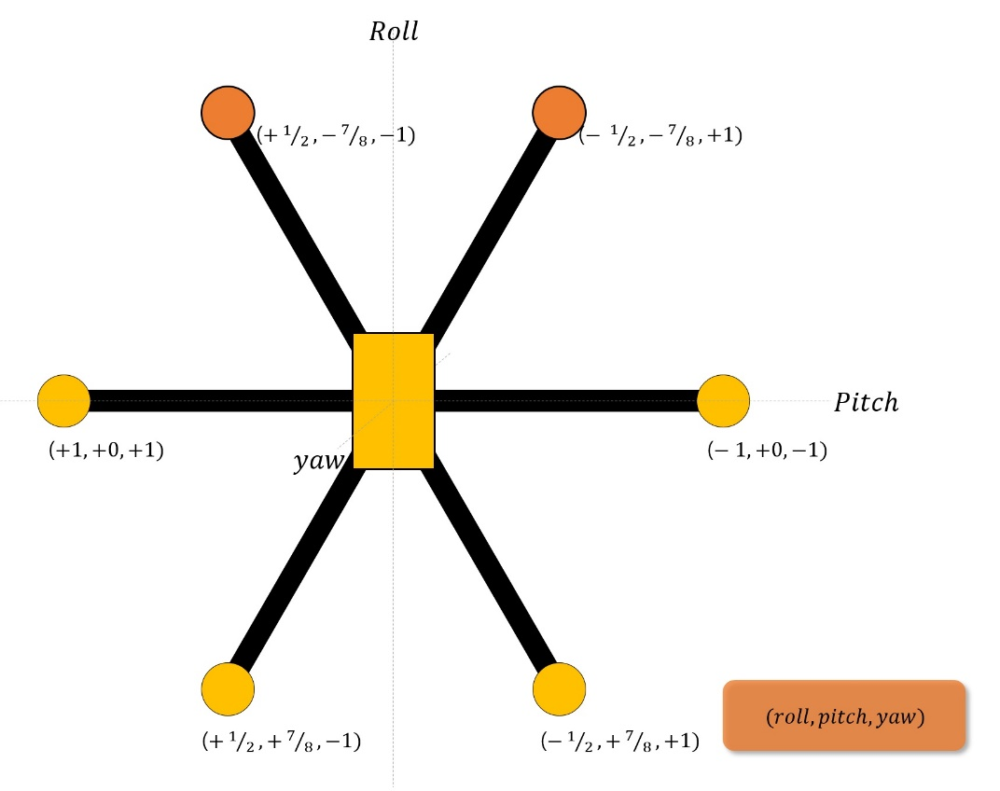
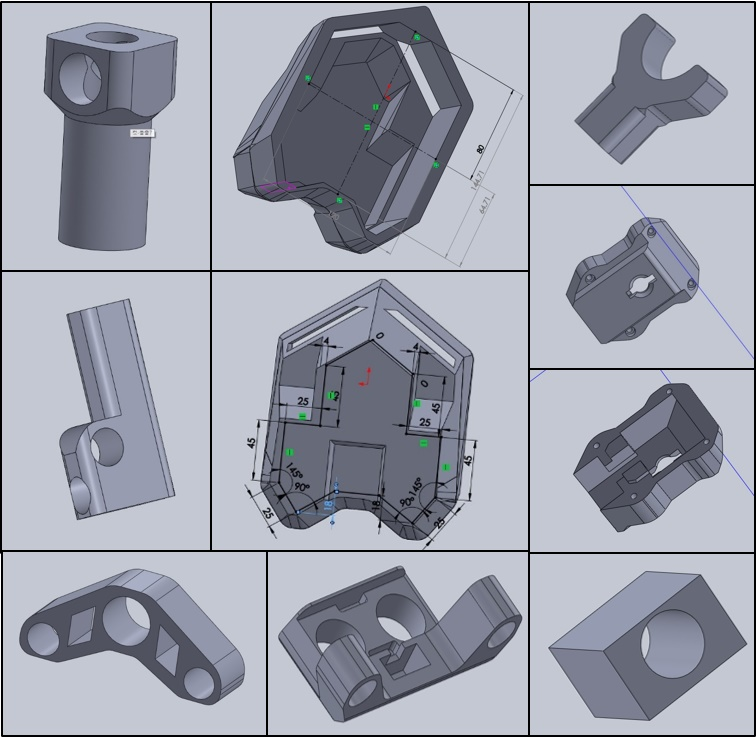
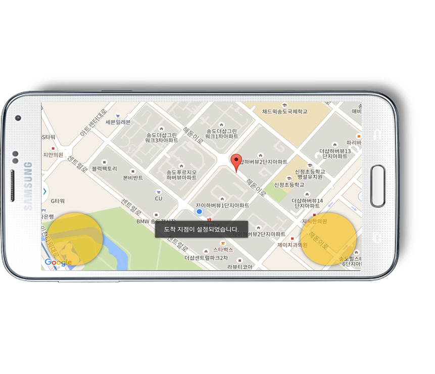
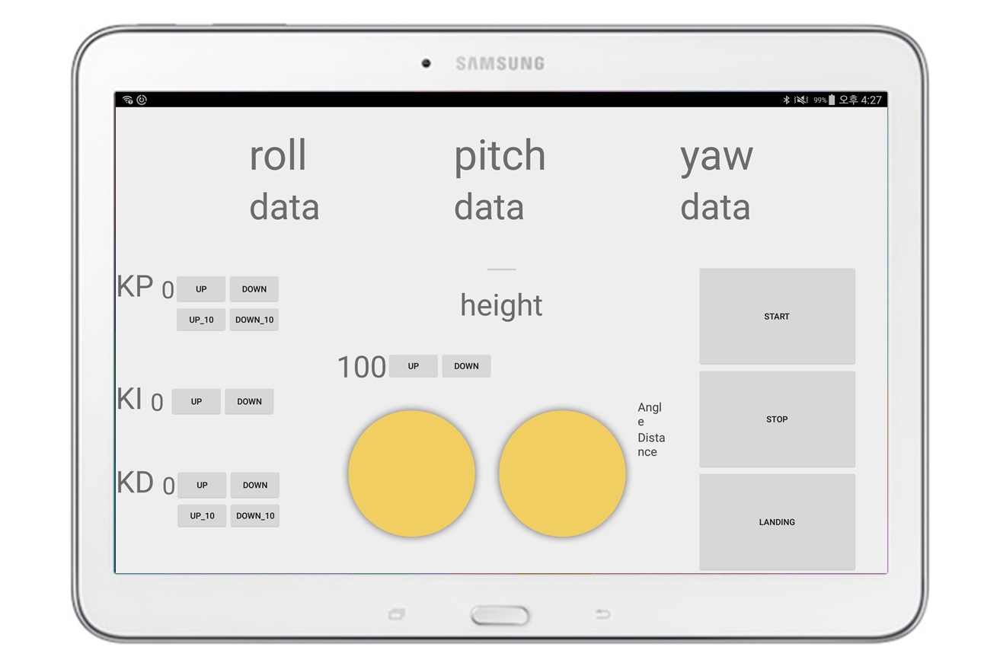

# DroneProject
##드론 개발 진행

###목표
1. DIY 드론을 위한 정보 공유
  - 드론에 사용된 모든 부품들과 단가까지 공개하여 실제 우리 드론과 똑같이 개발할 수 있는 환경을 제공한다.
2. 특정 지점을 가기 위한 드론 기술 구현
  -드론의 기본적인 기술을 구현하고, GPS를 이용한 특정 지점까지 드론이 자율 비행하는 기술을 구현한다. 

###시스템 구조도

###Drone Firmware (STM32F103RET6)
- Hexa Copter
- ARM Cortex-m3 STM32F103RET6 보드
- C Language
- 9축센서, 초음파 센서, GPS 모듈 Wifi 모듈을 탑제 
- Wifi -Module을 이용하여 Android App과 연동
- 호버링 및 위치 이동 컨트롤 가능

####사용 부품
|  NO  |  항목  |  부품명  |  수량  |
| :------: | ------ | ------ | --------:|
| 1 | 멀티콥터 프레임 | [TAROT] FY690S 헥사콥터 ARF Set | 1 |
| 2 | ARM Board | STM32_64P MCU Board | 2 |
| 3 | AHRS | EBIMU-9DOFV2 (AHRS, 자이로3축,가속도3축,지자기3축) | 1 |
| 4 | 대기압 센서 | Barometric Pressure Sensor Module : LPS25 | 1 |
| 5 | WiFi Module | WiFi Module - ESP8266 [WRL-13678] | 1 |
| 6 | GPS Module | 고정밀 GPS보드 [AKBU5] USB 출력=USB 출력, 안테나 타입=SMA, 안테나=안테나, 커넥터=6핀 커넥터 | 1 |
| 7 | 배터리 | 22.2v 6s 5400ma (35~70c) 리튬폴리머 배터리 | 2 | 
| 8 | 전압 체커 | 리튬 폴리머 전압 체커 및저전압 경보장치 (1~8셀 / 3.7v ~ 29.6v) | 1 |
| 9 | UBEC | UBEC DC/DC Step-Down (Buck) Converter - 5V @ 3A output | 1 |
| 10 | LED | PP592-8L63-Star 3W Yellow Power LED | 4 |
| 11 | LED | PP625-8L63-Star 3W RED Power LED | 2 |
| 12 | 프로펠러 | APC 12X3.8SFP 역피치 Prop | 3 |
| 13 | 프로펠러 | APC 12X3.8SF 전동용 Prop | 3 |
| 14 | 프롭가드 | 헥사콥터_EPP프롭가드 | 1 |

####회로도

####ESC 세팅
-	ESC(전자변속기)는 BLDC모터를 제어하기 위한 모듈.
-	대부분의 ESC는 PWM파형으로 제어하며, 그 주기는 50Hz 또는 400Hz이다.
-	ESC를 세팅하기 위해선 제조사 마다 다르지만 일반적으로 출력파형을– 30% - 0% ->50% 순으로 주면 된다. 

####PID 제어
-	비례, 적분, 미분 제어를 통해 원하는 목표치에 수렴하기 위한 제어 시스템
-	P(비례) 제어 : 현재 값과 목표 값에 대한 오차 비례를 통해 그 값을 제어
-	I(적분) 제어 : 오차 값을 꾸준히 누적하여 정상 오차를 제거하기 위해 사용
-	D(미분) 제어 : 이전 오차와 현재 오차의 차이를 통해 오버슈트를 제거하는 목적으로 목표치에 빠르고 정확하게 도달하기 위해 사용하는 제어

-	헥사콥터이기 때문에 각 축에 따른 PID 제어 값을 다르게 설정해주어야 한다. 아래의 그림은 모터의 위치와 제어 축에 따른 제어 비 이다.

####3D 프린트
-	초음파 센서의 장착과 ESC, LED 장착을 위해 설계
-	Roll, Pitch 축의 PID 제어 테스트를 위해 제작
-	Solid Works 2013 프로그램을 통해 제작

###휴대폰 어플 (WifiTest)
- AP확인 (휴대폰에서 드론시에만 메인페이지로 넘어갈 수 있게끔 함. 이를 위해서 현재 나의 와이파이 연결 상태와 접속한 와이파이를 비교한다.)
- 조이스틱 구현 (드론을 조정하기 위해 조이스틱에서 사용자가 입력한 각도값과 조정기 방향에 대한 깊이값을 측정한다)
- 통신(통신은 소켓통신으로 구현하였으면 드론이 뿌려주는 와이파이에 접속시에 이루어 진다. 통신으로 드론의 처음 시작위치 좌표와 도착지점 좌표, 조이스틱 조정값을 전송한다.)
- 구글맵 (구글맵을 활용하여 드론 비행의 시작위치와 도착위치를 지정 및 확인할 수 있다 이를 프레그먼트로 구현하여 맵과 조이스틱을 볼 수 있도록 설정)

####PID 어플 (PIDTest)
- 지속적인 값 받기 (드론에서 보내주는 roll, pitch, yaw, height값을 지속적으로 받기 위해서 쓰레드에서 값이 왔을 경우 이를 받고 TextView에서 보여지도록 어플을 구상하였다)
- 값 세팅 (드론의 중심을 잡기 위해 KP, KI, KD값인 개인값을 구해야한다. 개인값을 잡기 위해 값들을 세팅하여 보내주도록 하였다)
- 시작 및 종료 (드론의 가동을 위해 start와 stop으로 start시에 모터의 출력값을 드론에게 전송하고 stop시 종료값을 전송한다)

####소켓 서버 (ServerTest.java)
- 드론과 통신 테스트 전에 만들었으며 클라이언트에서 접속하는 이상 유무에 대해 알기 위해 만듦
- 클라이언트에서 주는값을 print하고 처음 roll, pitch, yaw 등의 값을 보내주어 안드로이드에서 이 값을 볼 수 있다.
